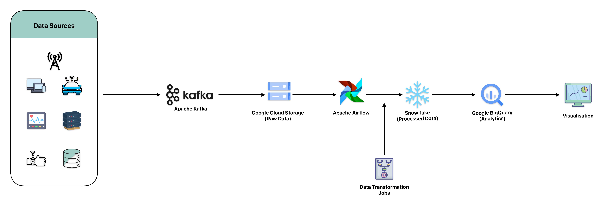

# Unified Data Lake Implementation Using GCP, Kafka, Airflow, and Snowflake

In the age of big data, businesses often find themselves grappling with disparate data sources. These sources can range from on-premises databases and third-party APIs to streaming data from IoT devices and file-based data such as logs or reports. The challenge lies in integrating this diverse data into a unified system that allows for efficient storage, processing, and analysis. Many organizations struggle with data silos, which hinder their ability to gain comprehensive insights and make informed decisions.

### Sample Scenario - `MadHatter Corp.`

`MadHatter Corp.`, a leader in innovative consumer products, was facing significant challenges managing disparate data sources that were essential for their operations. These sources ranged from on-premises databases that housed customer information and transactional records, to third-party APIs providing market trends and competitive intelligence, to streaming data from IoT devices embedded in their products, as well as file-based data such as sales reports and inventory logs.

The main challenge for `MadHatter Corp.` was integrating this diverse data into a cohesive system that allowed for efficient storage, processing, and analysis. Their data was siloed, stored across isolated systems without a unified approach, making it difficult to perform advanced analytics, optimize their supply chain, and personalize customer experiences based on real-time data. The lack of integration was leading to delayed insights, suboptimal decision-making, and challenges in achieving a seamless, data-driven operational strategy.

To address this challenge, `MadHatter Corp.` implemented a unified data lake solution leveraging Google Cloud Platform (GCP) services, along with Apache Kafka for real-time streaming, Apache Airflow for workflow orchestration, and Snowflake as a cloud-based data warehouse. This architecture allowed the company to integrate data across multiple sources, enabling real-time analysis, breaking down data silos, and allowing for more agile decision-making.

### GCP, Kafka, Airflow, and Snowflake Tools Used - DeepDive

#### Google Cloud Storage (GCS) 
Google Cloud Storage (GCS) served as the central repository for all data, providing a highly scalable cloud storage solution that could accommodate both structured and unstructured data. GCS acted as the backbone of `MadHatter Corp.`'s unified data lake, ensuring secure and scalable storage of all raw, processed, and archived data.

- **Key Features:**
  - **Scalability:** Automatically scales to meet the demands of growing data storage needs, supporting massive amounts of data with no upfront capacity planning required.
  - **Durability:** GCS offers 99.999999999% durability, ensuring that data is always safe and available, even in the face of infrastructure failures.
  - **Security:** GCS provides robust security features, including encryption at rest and in transit, access controls, and integration with IAM (Identity and Access Management) for fine-grained access permissions.
  - **Lifecycle Management:** Supports lifecycle management policies that automatically move data to lower-cost storage tiers based on pre-defined criteria, optimizing costs over time.

- **Use in Project:**  
  Google Cloud Storage was employed as the central repository where all raw data from various sources, including on-premises databases, IoT device streams, and third-party APIs, was ingested and stored. It also served as the location for transformed and processed data, ensuring that all data was easily accessible for further analysis, reporting, and archival.

#### Apache Kafka
Apache Kafka was integrated as the streaming platform responsible for ingesting real-time data from IoT devices and third-party APIs. Kafka ensured low-latency data processing and seamless integration with other components in the data architecture, enabling `MadHatter Corp.` to implement real-time analytics across its data pipelines.

- **Key Features:**
  - **Real-Time Data Streaming:** Kafka’s distributed architecture ensures high throughput and low latency, making it ideal for real-time data ingestion and stream processing.
  - **Scalability:** Kafka scales horizontally by adding more brokers to a cluster, enabling it to handle increasing volumes of data as `MadHatter Corp.`’s operations grew.
  - **Fault Tolerance:** Kafka ensures fault tolerance by replicating data across multiple nodes, making it resilient to node failures and guaranteeing data durability.
  - **Stream Processing:** Kafka integrates seamlessly with stream processing frameworks, allowing for real-time transformations and analytics on streaming data.

- **Use in Project:**  
  Apache Kafka was used to efficiently capture and stream data in real-time from IoT devices embedded in `MadHatter Corp.`’s products. Kafka was also used to ingest real-time data from third-party APIs, ensuring that the company had access to up-to-the-minute data on market trends, customer interactions, and operational metrics.

#### Apache Airflow
Apache Airflow was implemented to orchestrate and automate the complex data workflows at `MadHatter Corp.` It ensured efficient and reliable ETL (Extract, Transform, Load) processes, seamlessly integrating data from diverse sources and automating data pipeline execution.

- **Key Features:**
  - **Workflow Orchestration:** Airflow provides a powerful platform for scheduling and monitoring workflows, allowing `MadHatter Corp.` to define complex dependencies and ensure that all steps in the data pipeline were executed in the correct order.
  - **Extensibility:** Airflow supports custom plugins and integrations with numerous external services, making it easy to extend its functionality as `MadHatter Corp.`’s needs evolved.
  - **Fault Tolerance and Monitoring:** Airflow’s built-in fault tolerance features automatically retry failed tasks, ensuring that workflows were executed reliably. Its monitoring capabilities provided real-time visibility into pipeline execution.
  - **Scalability:** Airflow scales to handle large numbers of concurrent workflows, ensuring that even the most complex data pipelines could be executed efficiently.

- **Use in Project:**  
  Apache Airflow orchestrated the ETL workflows for `MadHatter Corp.`’s unified data lake solution. It automated the movement and transformation of data from various sources (e.g., on-premises databases, IoT streams, and file-based reports) into Google Cloud Storage and eventually into Snowflake for analytics. Airflow also managed complex scheduling and dependencies, ensuring data was processed in a timely and accurate manner.

#### Snowflake
Snowflake was chosen as the cloud data warehouse solution for `MadHatter Corp.`, enabling secure, scalable, and high-performance analytics. Snowflake’s unique architecture allowed the company to easily execute complex queries on large datasets, providing the insights necessary for data-driven decision-making.

- **Key Features:**
  - **Scalability:** Snowflake automatically scales to handle increasing workloads, allowing `MadHatter Corp.` to run analytics on vast amounts of data without worrying about performance bottlenecks.
  - **Separation of Compute and Storage:** Snowflake’s architecture decouples compute from storage, enabling independent scaling of each resource, ensuring cost-efficiency and optimal performance.
  - **Performance:** Snowflake leverages columnar storage, data compression, and parallel query execution to deliver fast query performance on large datasets.
  - **Security:** Provides strong data security features, including end-to-end encryption, multi-factor authentication, and role-based access controls.

- **Use in Project:**  
  Snowflake was used as the cloud-based data warehouse for `MadHatter Corp.`’s unified data lake architecture. It provided a centralized platform for running complex analytics on processed data stored in Google Cloud Storage. The company leveraged Snowflake to generate reports, gain insights into sales and operational metrics, and perform deep analytics on their unified data.

#### Google BigQuery
Google BigQuery was utilized to perform scalable data analytics on large datasets, optimizing performance for business intelligence workloads. Its serverless architecture ensured that `MadHatter Corp.` could execute complex SQL queries on petabyte-scale datasets without worrying about infrastructure management.

- **Key Features:**
  - **Serverless Architecture:** BigQuery is fully managed and requires no infrastructure management, enabling `MadHatter Corp.` to focus solely on analytics.
  - **Scalability:** BigQuery can handle massive datasets, providing virtually unlimited storage and compute capabilities.
  - **High Performance:** BigQuery delivers fast query performance through its columnar storage, data compression, and distributed processing engine.
  - **Integration:** Seamlessly integrates with other Google Cloud services, as well as third-party tools for visualization, such as Looker and Tableau.

- **Use in Project:**  
  Google BigQuery was used to perform scalable analytics on large datasets, providing actionable business intelligence and insights. It enabled `MadHatter Corp.` to quickly generate reports, run ad-hoc queries, and derive insights from their unified data infrastructure.

### Outcome

By implementing this unified data architecture using GCP services, Apache Kafka, Apache Airflow, and Snowflake, ``MadHatter Corp.`` successfully broke down data silos and improved their ability to perform real-time analytics. The company gained a comprehensive view of their data, enabling them to make data-driven decisions, enhance their product offerings, optimize operations, and deliver exceptional customer experiences. Real-time streaming and low-latency processing with Kafka, combined with efficient workflow orchestration through Airflow, allowed the company to respond swiftly to market changes and customer demands. Snowflake’s powerful data warehousing capabilities and BigQuery’s scalable analytics ensured that `MadHatter Corp.` could extract maximum value from their unified data lake, positioning them for continued growth in the competitive consumer products market.

## References

- [Google Cloud Storage (GCS)](https://cloud.google.com/storage)
- [Google BigQuery](https://cloud.google.com/bigquery)
- [Apache Kafka](https://kafka.apache.org/)
- [Apache Airflow](https://airflow.apache.org/)
- [Snowflake](https://www.snowflake.com/)
